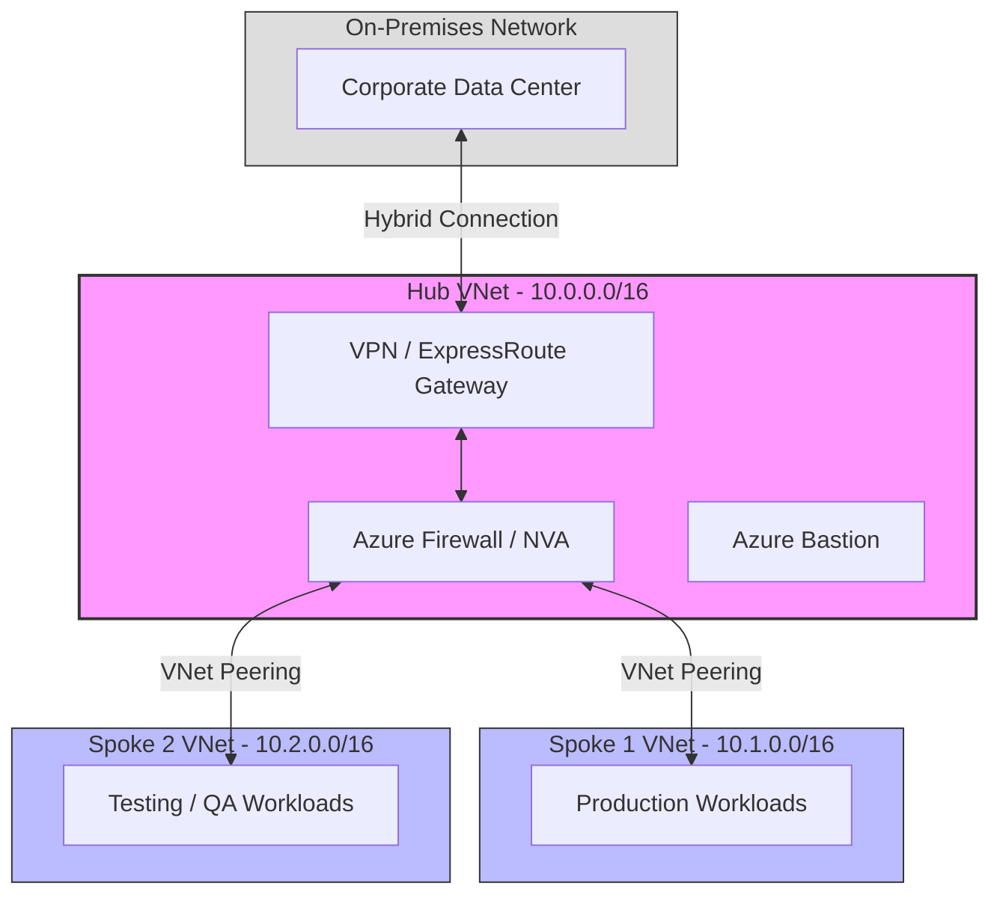

## Define an Azure network topology
  [link](https://learn.microsoft.com/en-us/azure/cloud-adoption-framework/ready/azure-best-practices/define-an-azure-network-topology)
  
### standard Hub-and-Spoke network topology in Azure

#### 1. How Spoke Communication Works (The Default vs. UDR)
By default, Azure automatically creates system routes for each subnet. When you peer Spoke 1 and Spoke 2 to the Hub, they can talk to the Hub, but Spoke 1 cannot talk to Spoke 2. VNet Peering is non-transitive.

To fix this and inspect traffic, we use the pattern you mentioned:

Step-by-Step Traffic Flow (Spoke 1 to Spoke 2)
The Trigger: A VM in Spoke 1 (10.1.0.4) wants to send data to a VM in Spoke 2 (10.2.0.4).

The UDR Interception: Instead of letting the traffic leave the VNet directly, a Custom Route Table attached to the Spoke 1 subnet intercepts the request.

The Next Hop: The UDR explicitly matches the traffic and forwards it to the Private IP of the Hub NVA/Firewall as the "Next Hop".

The Hub Processing: The NVA receives the packet, evaluates its firewall rules (Allow/Deny), and if allowed, routes it down to Spoke 2.

#### 2. Creating the UDR (How it looks in practice)
To force all traffic through your central Hub NVA, you typically define a Default Route (often called a catch-all route).

In Azure, you create a Route Table, add a route with the following properties, and associate it with your Spoke Subnets:

| Route Setting | Value | Description |
| :--- | :--- | :--- |
| **Route Name** | `to-Hub-NVA` | A descriptive name for the route. |
| **Address Prefix Destination** | `0.0.0.0/0` | Represents all traffic (Internet, other Spokes, On-Premises). |
| **Next Hop Type** | `Virtual Appliance` | Tells Azure you are using a firewall/NVA. |
| **Next Hop Address** | `10.0.X.X` | The exact internal private IP of your Azure Firewall or NVA. |
### Note : 💡 AZ-305 Exam Tip: If you only want to route inter-spoke traffic through the firewall but let Spokes go straight to the internet, your Address Prefix would be the specific IP range of the other Spokes (e.g., 10.2.0.0/16) instead of 0.0.0.0/0. However, filtering everything (0.0.0.0/0) is the most secure method.

### 3. What is used in the Real World?
While setting up manual UDRs and managing individual virtual appliances works well for smaller environments, large enterprises usually scale this using specific Azure enterprise patterns:
#### Pattern A: Azure Firewall + Azure Virtual WAN (vWAN) — Highly Recommended
Managing hundreds of UDRs across dozens of Spokes becomes a nightmare. In the real world, architects use Azure Virtual WAN with a Secured Virtual Hub.

How it works: Azure automatically injects and manages the routing lines for you. When you turn on Azure Firewall in a vWAN hub, it instantly advertises 0.0.0.0/0 to all connected spokes automatically—no manual UDR creation required.

#### Pattern B: Third-Party NVAs (Palo Alto, Check Point, Fortinet)
Many enterprises prefer using the same firewall vendors in the cloud that they use on-premises.

They deploy these NVAs in a High Availability (HA) cluster behind an Azure Internal Load Balancer (ILB) inside the Hub VNet.

In this scenario, your UDR's "Next Hop Address" points directly to the Internal Load Balancer's IP, which then balances the traffic across the active firewall appliances.

#### Pattern C: Gateway Transit for On-Premises
For your hybrid connection to work cleanly across the architecture:

The Hub VNet Peering setting must have "Use this virtual network's gateway or Route Server" checked.

The Spoke VNet Peering setting must have "Use the remote virtual network's gateways" checked.

This allows Spokes to utilize the Hub's VPN/ExpressRoute gateway seamlessly without needing a separate gateway in every single VNet.

| Traffic Path | Do you need a UDR? | How it routes |
| :--- | :--- | :--- |
| **Spoke ↔ On-Premises** | ❌ No | Handled automatically by the Gateway Transit peering toggle. |
| **Spoke 1 ↔ Spoke 2** |  Yes | Requires a UDR pointing to the Hub Firewall IP to bridge the two spokes. |
